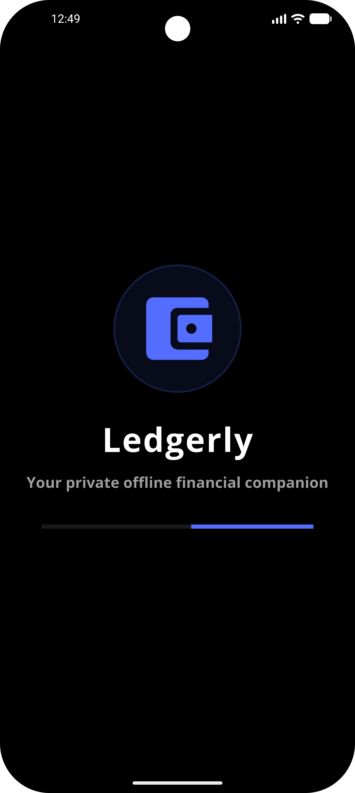
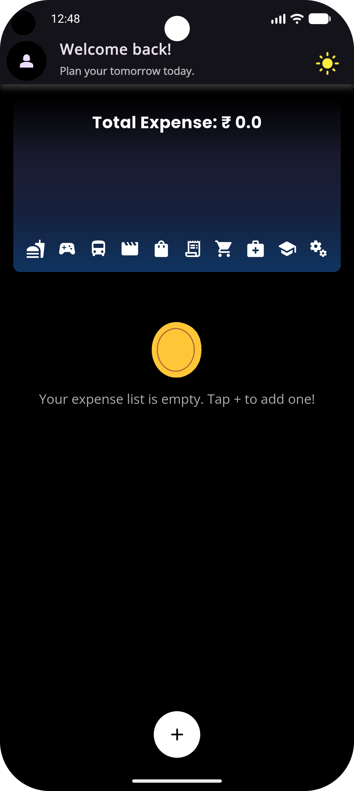
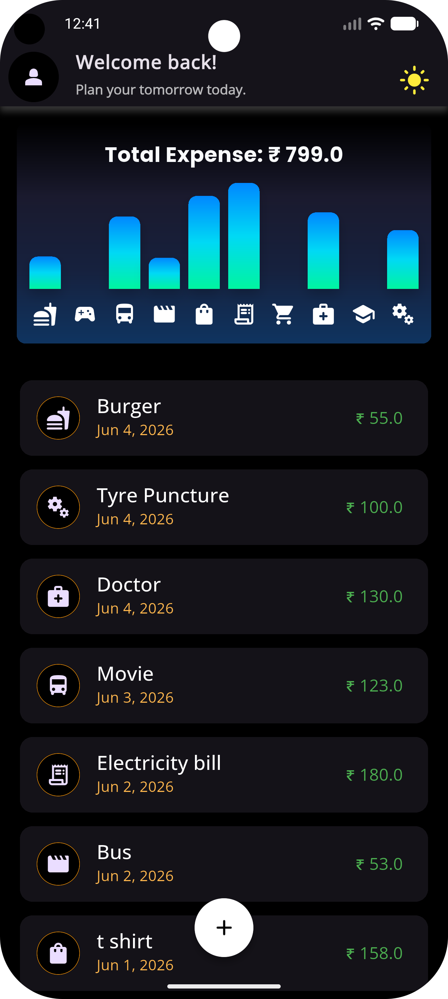
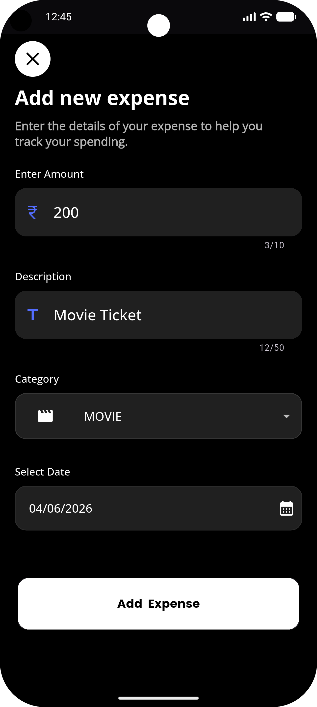
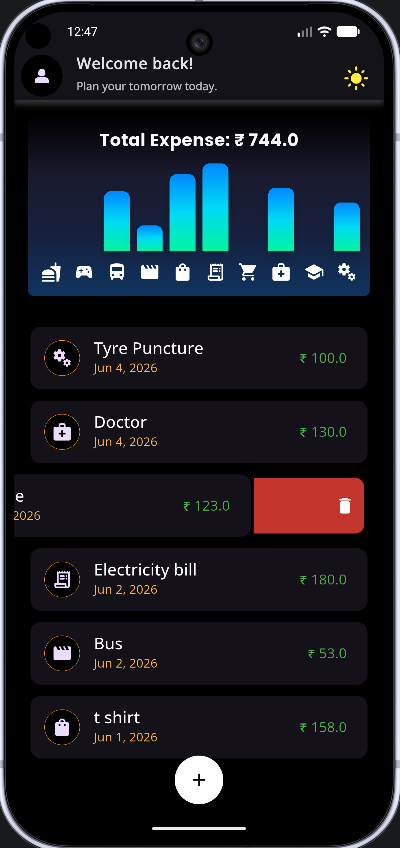
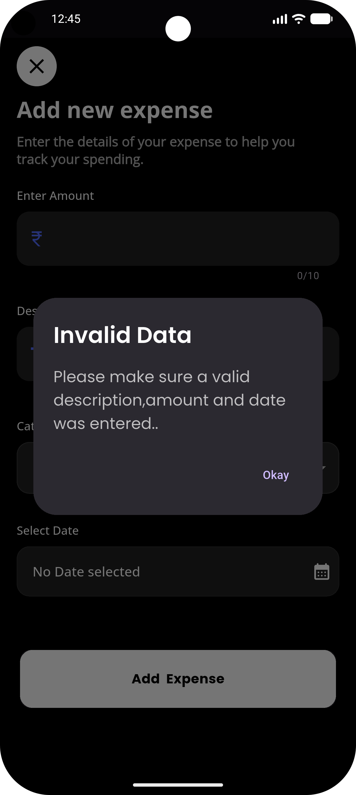

<h1>Ledgerly 📱💼</h1>

  
  

<b>Tagline:</b> <i>Smart Tracking. Absolute Privacy. Continuous Growth.</i>

Ledgerly is a premium, high-performance personal finance management and expense tracking mobile application built using Flutter. Architected specifically to operate entirely offline, Ledgerly prioritizes absolute user data privacy and localized security by utilizing a high-speed transactional key-value NoSQL database.

<h2>📌 About the Application</h2>

Ledgerly represents a major step forward in mastering advanced mobile development workflows. Moving away from standard, basic CRUD tutorials, this application implements strict on-device database tracking, custom gesture recognizers (swipe-to-delete dismissibles), rigorous validation modals for input error handling, and highly responsive graphic data visualization.

<h2>🖼️ Application Showcase</h2>

  
  
  

  
  
  

<h2>✨ Core Engineering Features</h2>

<ul>
  <li>🔒 <b>100% Offline Architecture:</b> Requires zero network access permissions, completely eliminating cloud-leak risks or external server dependencies.</li>
  <li>⚡ <b>High-Speed Data Persistence:</b> Integrated with <b>Hive CE (Community Edition)</b> utilizing custom-generated binary TypeAdapters for immediate read/write cycles and synchronized data transactions.</li>
  <li>📊 <b>Reactive Data Visualization:</b> Custom high-fidelity financial bar charts that plot and sort spending trends and categorical distribution dynamically against a sleek black backdrop.</li>
  <li>🗑️ <b>Gesture-Driven Actions:</b> Features <code>Dismissible</code> sliding list tiles that provide fluid swipe-to-delete interactions with real-time state synchronization.</li>
  <li>🛡️ <b>Robust Data Validation:</b> Built-in defensive programming layers utilizing stylized modal popups to catch invalid or missing inputs before database entry.</li>
  <li>🔄 <b>Native Adaptive Launcher Configuration:</b> Fully configured system launcher layers displaying a native, perfectly circular icon masked beautifully across all modern Android devices.</li>
</ul>

<h2>🧭 Application Architecture Workflow</h2>

<ol>
  <li>
    <b>Application Initialization</b>
    <ul>
      <li>Hive database boxes are opened and initialized synchronously before the UI loads to ensure no null pointer exceptions during data hydration.</li>
    </ul>
  </li>

  <li>
    <b>Dashboard & Financial Feed</b>
    <ul>
      <li>The core UI listens reactively to changes inside the Hive box, updating the user's total balance and historical transaction lists immediately without requiring a manual page refresh.</li>
    </ul>
  </li>

  <li>
    <b>Interactive Analytics Screen</b>
    <ul>
      <li>Aggregates local data records and parses them into proportional coordinate arrays to feed the dynamic categorical spending bar charts.</li>
    </ul>
  </li>

  <li>
    <b>Transaction Lifecycle Management</b>
    <ul>
      <li>Users can append or delete transactions. Deletions trigger automatic system cleanups within the background Hive storage to minimize disk space.</li>
    </ul>
  </li>
</ol>

<h2>🛠️ Tech Stack & Dependencies</h2>

<ul>
  <li><b>Framework:</b> Flutter (Stable Channel)</li>
  <li><b>Language:</b> Dart</li>
  <li><b>Local Database Engine:</b> Hive CE & <code>hive_ce_generator</code></li>
  <li><b>Compilation Tools:</b> <code>build_runner</code> & <code>flutter_launcher_icons</code></li>
  <li><b>Motion Engine:</b> Lottie Flutter</li>
  <li><b>Target Platform:</b> Android (API 21+) / iOS</li>
</ul>

<h2>🚧 Current Development Status</h2>

✅ <b>v1.0.0 Completed</b> (Fully functional offline engine, custom native branding asset integration, and type-safe data pipelines are production-ready).

<h2>🔮 Future Architecture Enhancements</h2>

<ul>
  <li>📁 CSV/Excel export utility to allow users to securely back up local records externally.</li>
  <li>⏱️ Biometric security integration (Fingerprint / Face ID unlocking) via native channels.</li>
  <li>🔔 Local scheduled notifications for daily spending and budgeting reminders.</li>
</ul>

<h2>🚀 Local Setup & Installation</h2>

To clone and audit the codebase locally on your machine, execute the following commands inside your development terminal:

<pre>
git clone https://github.com/PritamSapkal/ledgerly.git
cd ledgerly
flutter pub get
dart run build_runner build --delete-conflicting-outputs
dart run flutter_launcher_icons
flutter run
</pre>

<h2>🤝 Contribution & Code Review</h2>

This repository showcases solid architectural foundations for offline mobile computing. Recommendations regarding advanced local query indexing or deep state caching patterns are highly welcomed.

<h2>📄 Educational License</h2>

This application is engineered strictly for learning, architectural demonstration, and educational portfolio purposes.

⭐ If you find this engineering implementation useful, feel free to star the repository!

